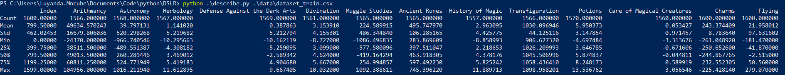
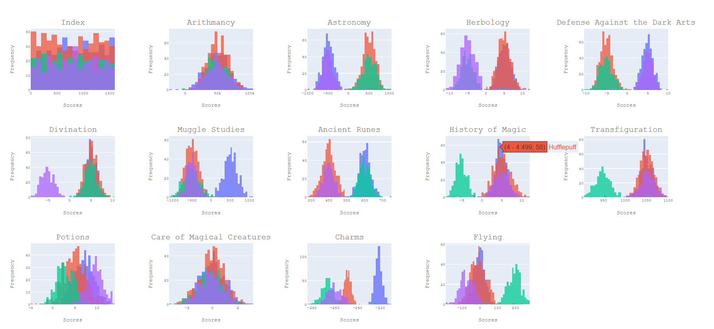
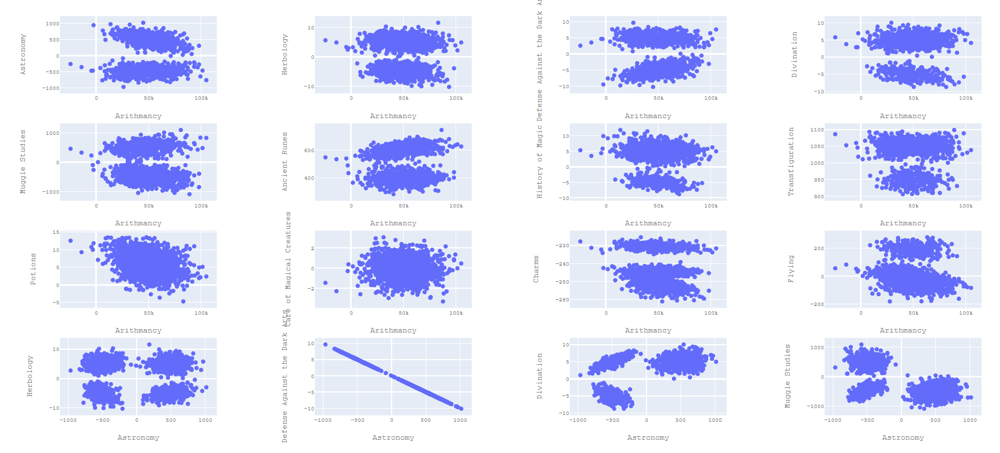

# DSLR
Data Science: Logistic Regression

:( refer to [this](https://github.com/luyandamncube/ft_linear_regression)

This project explores Machine Learning by implementing a linear classification model, as a continuation of the 42 module `ft_linear_regression`.

## Logistic Regression
* [Logistic Regression](https://www.statisticssolutions.com/what-is-logistic-regression/) is a topic in statistics used to describe data and form a relationship between one binary dependant variable, and other independant variables.
* An example of a question that Logistic Regression aims to answer is *Do body weight, calorie intake, fat intake, and age have an influence on the probability of having a heart attack (yes vs. no)?*
* Sometimes logistic regressions are difficult to interpret; tools exist easily allows you to conduct the analysis, then in plain English interprets the output.

## Objective
This project aims to implement a linear classification model, as a continuation of `ft_linear_regression`. Steps to do this include:
1. Read a dataset
2. Visualise the dataset in various ways (to create insights and develop an intuition of what your data looks like)
3. Select and clean unnecessary information from your data.
4. Train a logistic regression that will solve classification problem
5. Ensure the algorithm chosen has a minimum precision of 98%

## Data Analysis
1. [Five number summary](https://en.wikipedia.org/wiki/Five-number_summary)
`python .\describe.py .\dataset\dataset_train.csv`

  

2. [Histogram](https://statisticsbyjim.com/basics/histograms/)
`python .\histogram.py .\dataset\dataset_train.csv`

  

From the above, both 'Arithmancy' and 'Care of Magical Creatures' have homogenous score distributions  

3. [Scatter Plot](https://en.wikipedia.org/wiki/Scatter_plot)
`python .\scatter_plot.py .\dataset\dataset_train.csv`

  

From the above, the two feautures that are similar are 'Defense Against the Dark Arts' & 'Astronomy'. These will be the feautures selected to perform the Logistic Regression.

## Logistic Regression

## Topics covered
* Statistics
* Predictive Analysis
* Regression Modelling
* Data Visualisation

